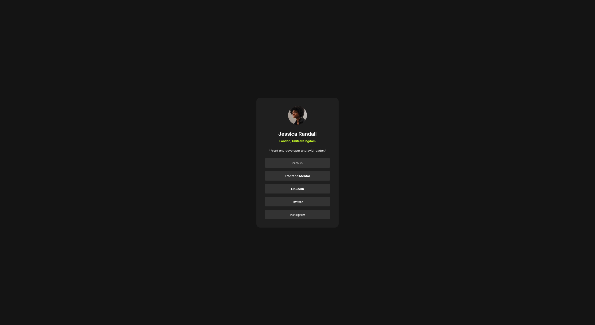
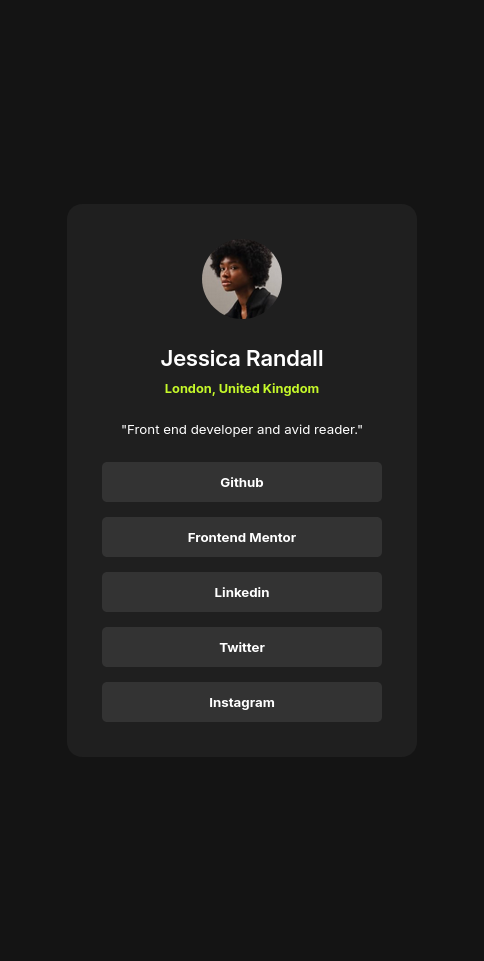
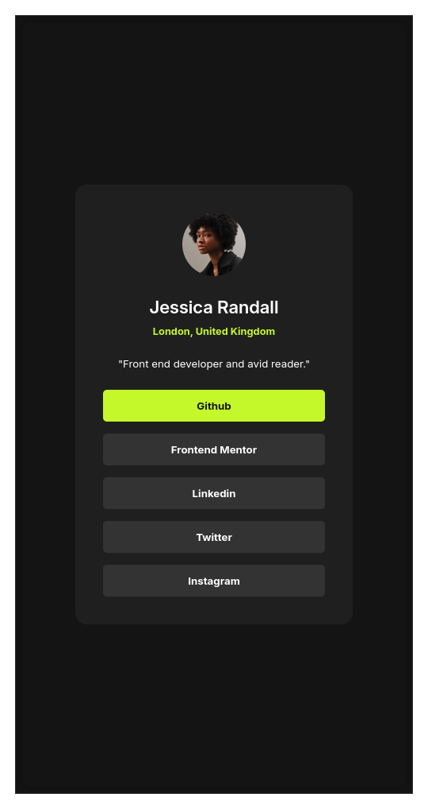

# Frontend Mentor - Social links profile solution

This is a solution to the [Social links profile challenge on Frontend Mentor](https://www.frontendmentor.io/challenges/social-links-profile-UG32l9m6dQ). Frontend Mentor challenges help you improve your coding skills by building realistic projects. 

## Table of contents

- [Overview](#overview)
  - [Screenshot](#screenshot)
  - [Links](#links)
- [My process](#my-process)
  - [Built with](#built-with)
  - [What I learned](#what-i-learned)

## Overview

### Screenshot

Add a screenshot of your solution. The easiest way to do this is to use Firefox to view your project, right-click the page and select "Take a Screenshot". You can choose either a full-height screenshot or a cropped one based on how long the page is. If it's very long, it might be best to crop it.

Alternatively, you can use a tool like [FireShot](https://getfireshot.com/) to take the screenshot. FireShot has a free option, so you don't need to purchase it. 

Then crop/optimize/edit your image however you like, add it to your project, and update the file path in the image above.

### Links

- Solution URL: [Github repository](https://github.com/SaucDev/Social-links-profile)
- Live Site URL: [Github page](https://saucdev.github.io/Social-links-profile/)

## My process

### Built with

- Semantic HTML5 markup
- Flexbox
- Web-first workflow

### What I learned

Learnt more about correct semantic use, may not be totally accurate but im getting to differentiate them better.

Used a placeholder for every link but placed them in the page as real links instead of just decorations.

More understanding of the spacing of elements and visual direction and importance of contrast.